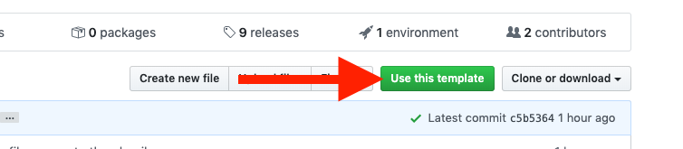

# md-slides template

[![GitHub Actions][gh_actions_badge]][gh_actions]
[![GitHub Pages][gh_pages_badge]][gh_pages]
[![GitHub Releases][gh_releases_badge]][gh_releases]

This template can be used to automatically render `PITCHME.md` files into [marp](https://marp.app) presentations. Wh you push to the master branch the workflow will render your slides, create a github release and updated your github page with no additional configuration. 

This template follows the `PITCHME.md` convention introduced by [GitPitch](https://gitpitch.com/docs/getting-started/pitchme/). The `PITCHME.md` of your repository will be used to render the presentation in all of its formats (`pdf`, `pptx`, and `html`). Have a look a the [demo slides](https://ivoputzer.github.io/md-slides-template).

## Instructions
1. Navigate to the main page of the template repository.
2. Above the file list, click **Use this template**.

3. Select the owner account and name the new repository.
4. Click **Create repository from template**.

This steps will boostrap your new presentation using this template.

## Fetch upstream changes
Setup `upstream` to whatever name you want
```sh
git remote add upstream git@github.com:ivoputzer/md-slides-template.git
```

Integrate changes from `upstream` into your own repository
```sh
git fetch --all
git checkout upstream/master .github/workflows/md-slides.yml
git commit -m "integrates md-slides workflow changes from upstream"
```

## Create your own template
1. Fork this repository
2. Use your own template while following the [instructions](#Instructions)
3. Make an edits
4. Consider to submit a [Pull Request](https://help.github.com/en/github/collaborating-with-issues-and-pull-requests/about-pull-requests#about-pull-requests) 🎉

[gh_actions]: https://github.com/ivoputzer/md-slides-template
[gh_actions_badge]: https://img.shields.io/github/workflow/status/ivoputzer/md-slides-template/markdown%20slides/master?style=for-the-badge&logo=github

[gh_pages]: https://github.com/ivoputzer/md-slides-template/deployments
[gh_pages_badge]: https://img.shields.io/static/v1?style=for-the-badge&label=page&message=online&color=success&logo=github

[gh_releases]: https://github.com/ivoputzer/md-slides-template/releases
[gh_releases_badge]: https://img.shields.io/github/v/release/ivoputzer/md-slides-template?style=for-the-badge&logo=github
